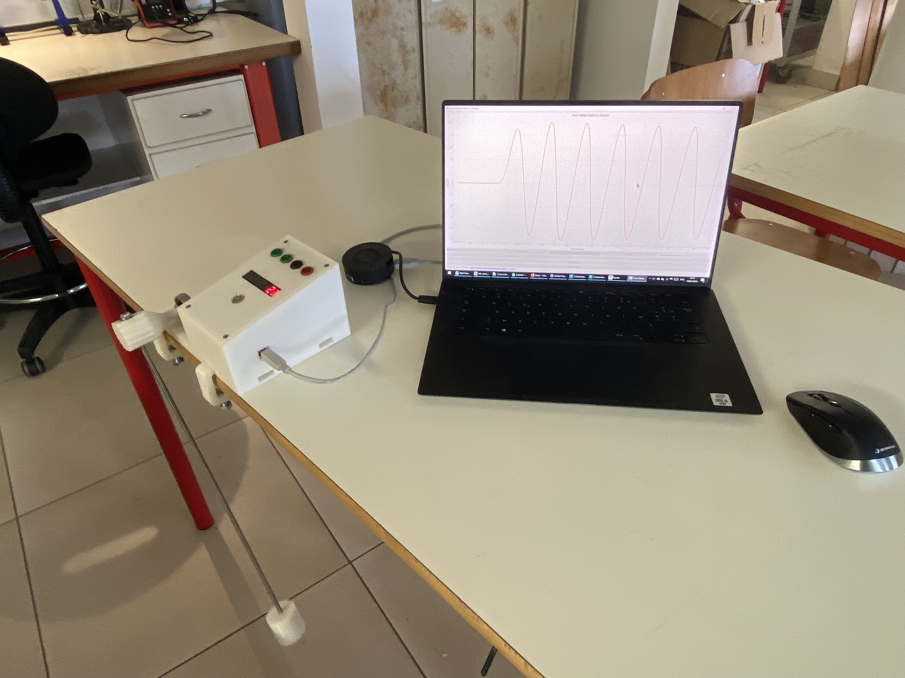
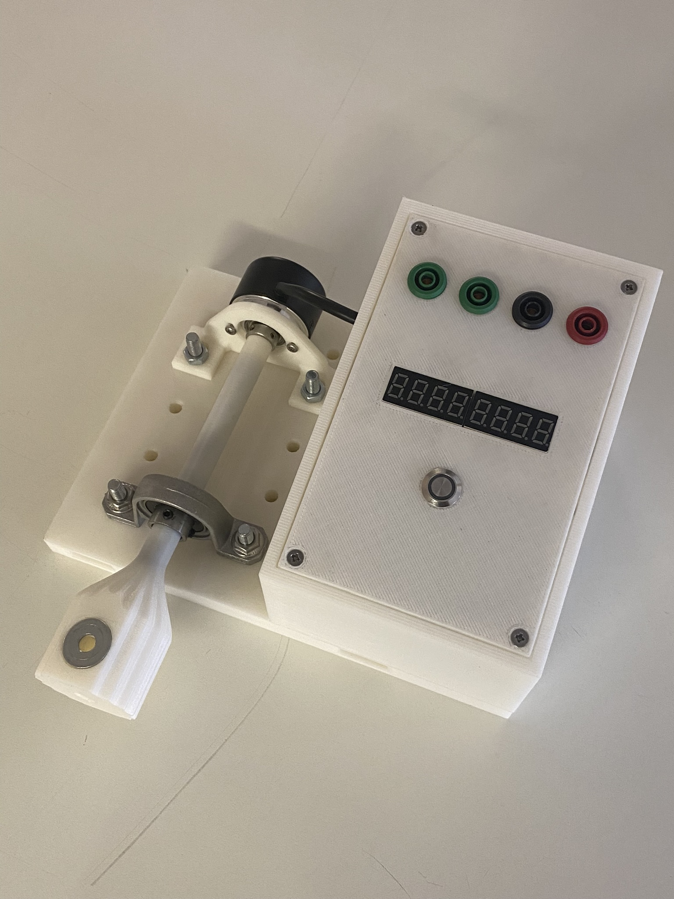
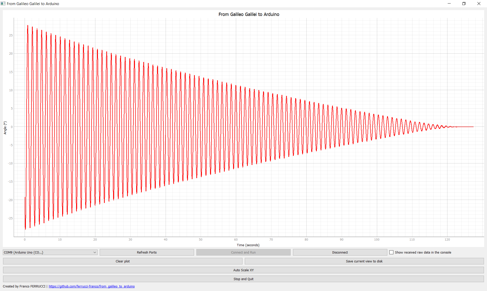
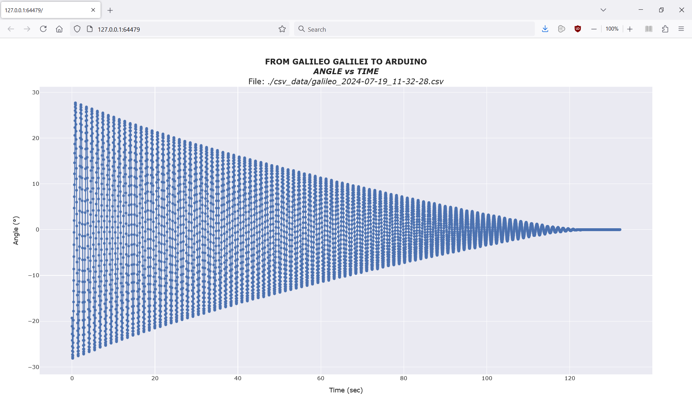

# From Galileo Galilei to Arduino
Teaching material of a simple pendulum with angle measurement and real-time plot.
## Table of Contents
- [Description](#description)
- [Videos](#videos)
- [Photos & Screenshots](#photos--screenshots)
  - [Photos](#photos)
  - [Real-Time Plot](#real-time-plot)
  - [Exported CSV file visualisation](#exported-csv-file-visualisation)
  - [Curve fitting](#curve-fitting)
- [Requirements](#requirements)
- [Python Code Installation](#python-code-installation)
- [Contribution](#contribution)
- [Contact](#contact)

## Description
This project involves measuring the angle of a simple pendulum and plotting the data in real-time using Arduino and Python. The system captures the pendulum's angle data via a serial interface and displays it graphically. The code provided includes functionality for data acquisition, real-time plotting, and saving data to disk.

In this repository you will find the following elements:
- Arduino code
- Python code for:
  - The real-time graphical user interface (GUI)
  - An off-line data visualization tool of CSV measured data (using Plotly library).
  - A script with a curve-fitting tool for a sinusoidal curve with exponential decay.
  - A script with the numerical integration of the equation of motion and comparison with measurement (with an example!).
- CAD files and 3D printer files (I used Creality K1 printer). In a future commit I will upload the Fusion360 files.
- Pictures and screenshots.
## Videos
For an overview and demonstration of the project, you can watch the following videos:

- [Video 1 (YouTube)](https://youtu.be/FJ6ZPmrugeg?si=X3V44YTVULSpro3k)
- [Video 2 (YouTube)](https://youtube.com/shorts/YBjDby0IXsI?si=bWYj2W4k94o8iF31)

## Photos & Screenshots
Here are some photos and screenshots of the project in action:

### Photos



### Real-Time Plot


### Exported CSV file visualisation


### Curve fitting 


## Requirements
- Arduino or compatible microcontroller
- Python 3.x
- Required Python libraries: `PyQt5`, `pyqtgraph`, `serial`, `pandas`, `plotly`

## Python Code Installation
To set up the necessary environment for running the provided Python code, follow the instructions below. This guide will walk you through creating an Anaconda environment called `galileo_to_arduino` and installing all the required libraries.
### Step 1: Install Anaconda
If you do not have Anaconda installed, you can download and install it from [the official Anaconda website](https://www.anaconda.com/products/distribution).
### Step 2: Create a New Environment
Open the Anaconda prompt and execute the following commands to create a new environment called `galileo_to_arduino`:
```
conda create --name galileo_to_arduino
```
### Step 3: Activate the Environment
Activate the newly created environment with the following command:
```
conda activate galileo_to_arduino
```
### Step 4: Install Required Libraries
Install the necessary libraries using the following commands:
```
conda install pyqt
conda install -c conda-forge pyqtgraph
conda install -c conda-forge pyserial
conda install pandas
conda install numpy
conda install scipy
conda install -c plotly plotly
```
### Step 5: Verify the Installation
To ensure all the libraries are installed correctly, you can run the following Python code:
```
import sys
import re
import os
from PyQt5.QtWidgets import QApplication, QMainWindow, QVBoxLayout, QHBoxLayout, QWidget, QPushButton, QComboBox, QCheckBox, QLabel
from PyQt5.QtCore import QTimer, QThread, pyqtSignal
import pyqtgraph as pg
import serial
import serial.tools.list_ports
import datetime
import pandas as pd
import numpy as np
from scipy.integrate import solve_ivp
import plotly.graph_objs as go
import plotly.io as pio
from scipy.optimize import curve_fit
import scipy.fftpack
from plotly.subplots import make_subplots
```
If no errors occur, the environment is set up correctly.
## Contribution
Feel free to contribute to this project by providing feedback, bug reports, or enhancements. You can also fork the repository and submit a pull request.
## Contact
For any questions or further information, please contact [Franco FERRUCCI](mailto:franco.ferrucci@upf.pf).
