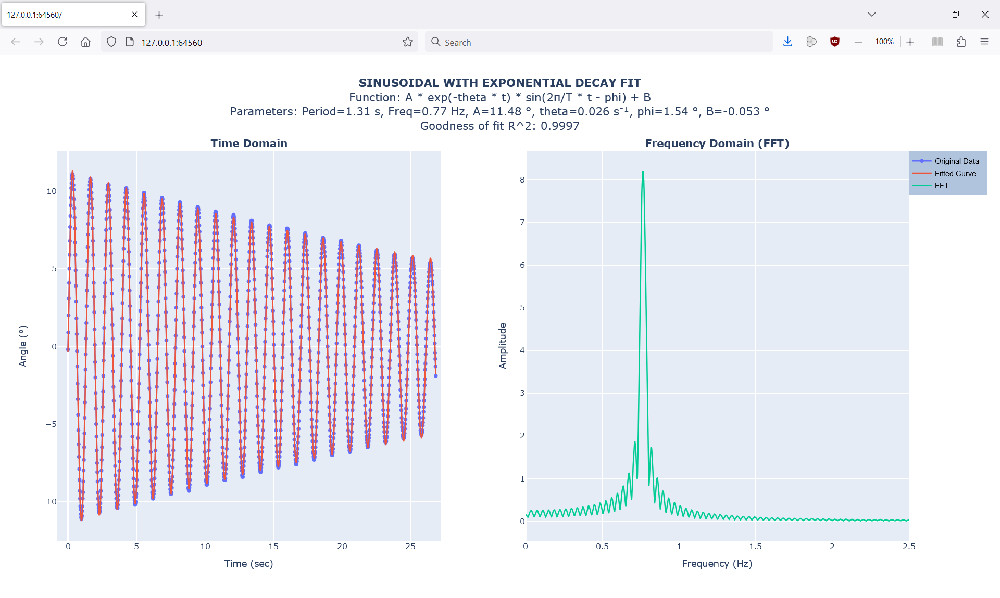

# From Galileo Galilei to Arduino

Teaching material of a simple pendulum with angle measurement and real-time plot.

## Description
This project involves measuring the angle of a simple pendulum and plotting the data in real-time using Arduino and Python. The system captures the pendulum's angle data via a serial interface and displays it graphically. The code provided includes functionality for data acquisition, real-time plotting, and saving data to disk.

In this repository you will find the following elements:
- Arduino code
- Python code for:
  - The real-time graphical user interface (GUI)
  - An off-line data visualization tool of CSV measured data (using Plotly library).
  - A script with a curve-fitting tool for a sinusoidal curve with exponential decay.
  - A script with the numerical integration of the equation of motion and comparison with measurement (with an example!).
- CAD files and 3D printer files (I used Creality K1 printer). In a future commit I will upload the Fusion360 files.
- Pictures and screenshots.

## Videos
For an overview and demonstration of the project, you can watch the following videos:

- [Video 1 (YouTube)](https://youtu.be/FJ6ZPmrugeg?si=X3V44YTVULSpro3k)
- [Video 2 (YouTube)](https://youtube.com/shorts/YBjDby0IXsI?si=bWYj2W4k94o8iF31)

## Photos & Screenshots
Here are some photos and screenshots of the project in action:

### Photos

### Real-Time Plot

### Exported CSV file visualisation

### Curve fitting 

## Requirements
- Arduino or compatible microcontroller
- Python 3.x
- Required Python libraries: `PyQt5`, `pyqtgraph`, `serial`, `pandas`, `plotly`

## Contribution
Feel free to contribute to this project by providing feedback, bug reports, or enhancements. You can also fork the repository and submit a pull request.

## Contact
For any questions or further information, please contact [Franco FERRUCCI](mailto:franco.ferrucci@upf.pf).
